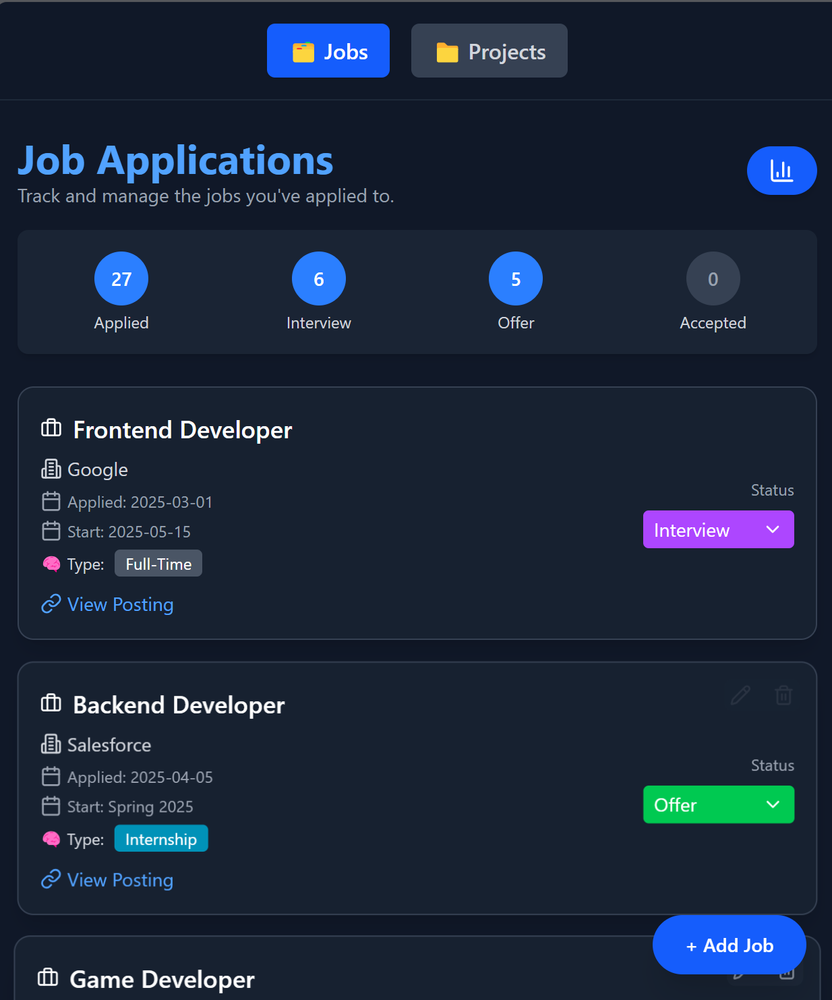
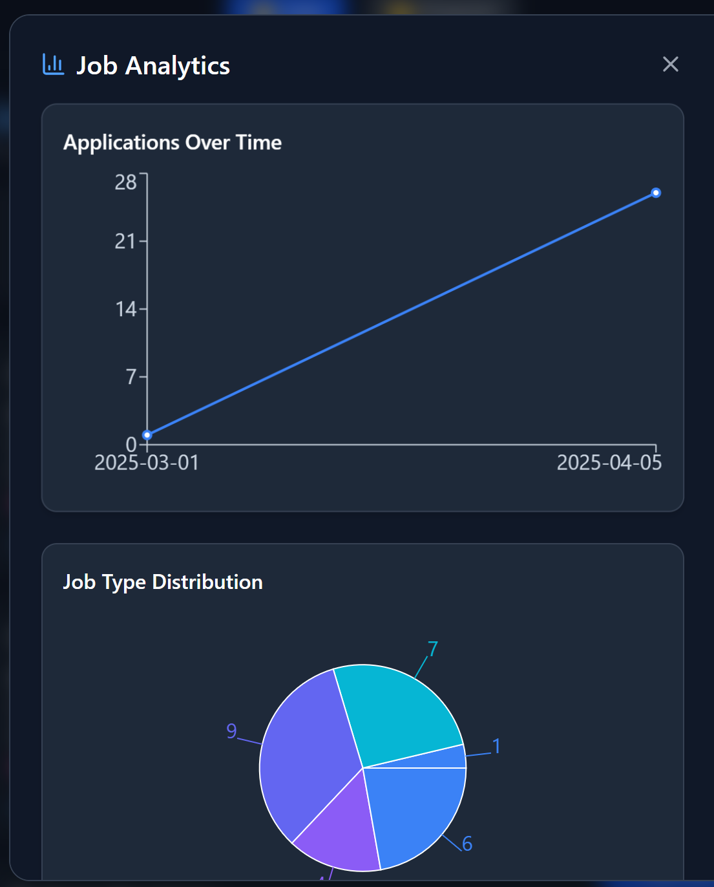

🧙 TheShire
--------

TheShire is a private, self-hosted job application tracker built with a FastAPI backend and a Vite + React frontend. It allows users to manage job applications with support for titles, companies, dates, statuses, notes, and links.

The current version includes a fully functional Job tracking page. A Projects tab is planned for future development.

--------

Quick Start (Local Usage)

To run TheShire locally using Docker:

1. Clone the repository

    git clone https://github.com/wrmoulton/TheShire.git
    cd TheShire

2. Ensure Docker and Docker Compose are installed.

3. Start the app using Docker Compose:

    docker compose up --build

4. Open your browser and navigate to:

    http://localhost:3000

The frontend will be available at port 3000, and it will automatically connect to the backend running on port 8000 within Docker.

This setup is intended for local development and single-user access from the same machine.

--------

Personal Hosting with Tailscale

To access TheShire securely on any of your personal devices from anywhere (home, work, on the go), you can host it on a Raspberry Pi and use Tailscale to create a private, secure network.

Setup:

1. Install Docker and Docker Compose on your Raspberry Pi:

    curl -fsSL https://get.docker.com | sh
    sudo usermod -aG docker wrmoulton
    sudo apt install docker-compose -y
    sudo reboot

2. Clone the project and start the application:

    git clone https://github.com/YOUR_USERNAME/TheShire.git
    cd TheShire
    docker compose up --build -d

3. Install and configure Tailscale:

    curl -fsSL https://tailscale.com/install.sh | sh
    sudo tailscale up

    Follow the login instructions in the browser to connect your Pi to your personal Tailscale network.

4. On your other devices, install the Tailscale app from https://tailscale.com/download and log in with the same account.

5. Access the app from your browser using:

    http://<raspberry-pi-name>.ts.net:3000

or

    http://<tailscale-ip>:3000

This setup is secure, requires no port forwarding, and keeps your app accessible only to your own devices.

--------

Development Status

- The Job tab is fully implemented.
- The Projects tab is planned for a future update.

--------

Notes

- The SQLite database file (shire.db) is excluded from version control.
- Docker handles containerized deployment for both frontend and backend.
- Tailscale ensures encrypted access to your Raspberry Pi without exposing public IPs.

--------

License

This project is licensed for personal use. Contact the repository owner for permissions regarding redistribution or reuse.
